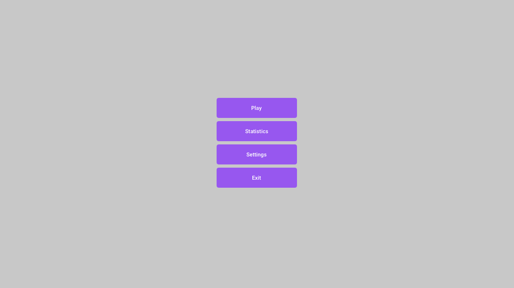
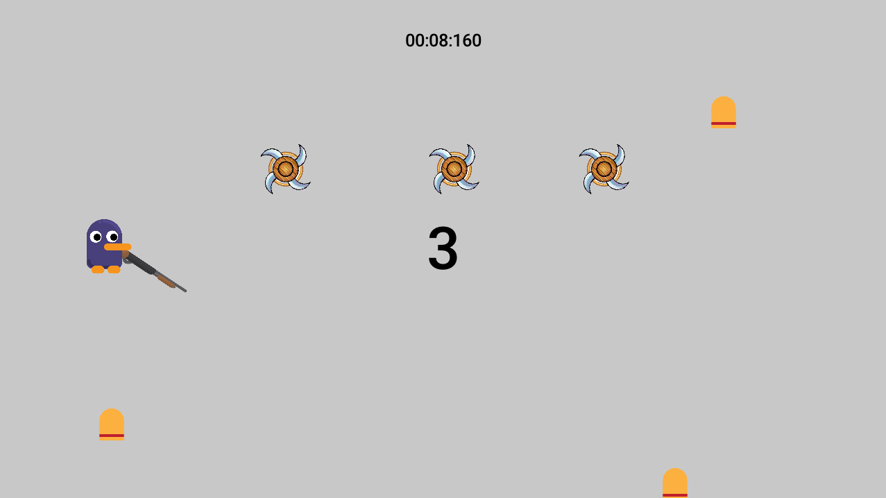
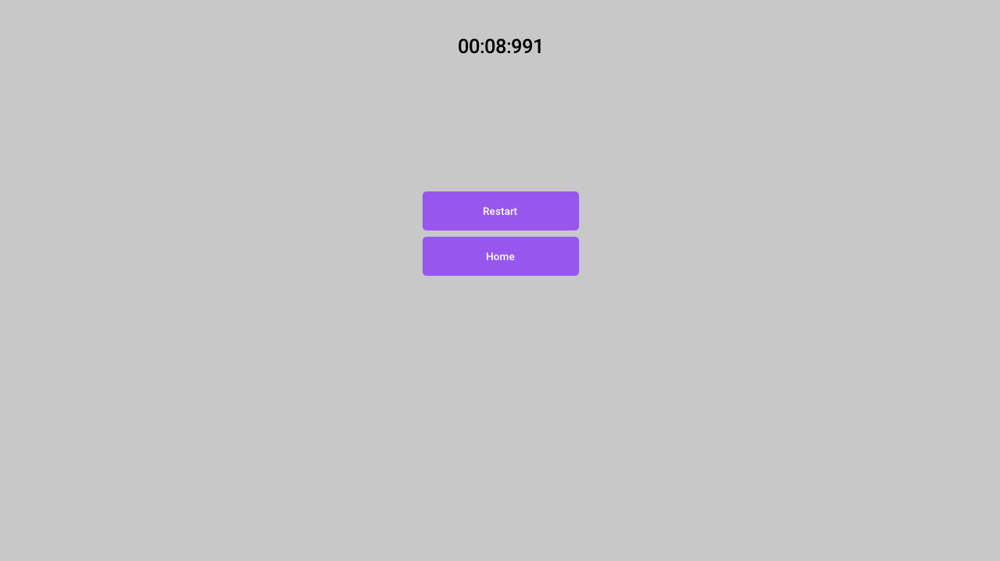
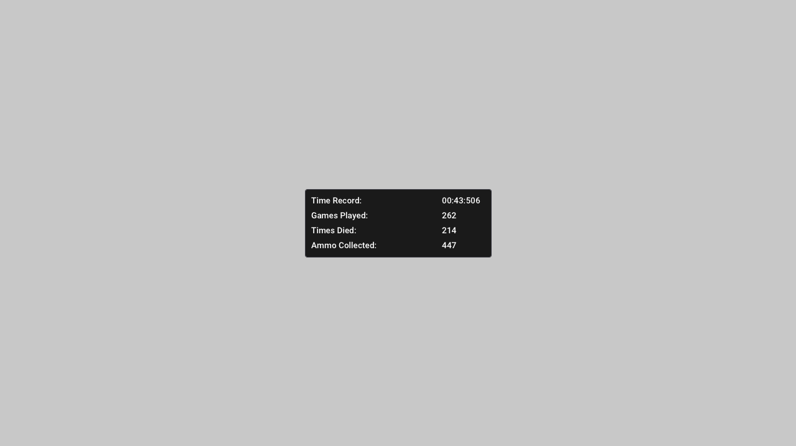
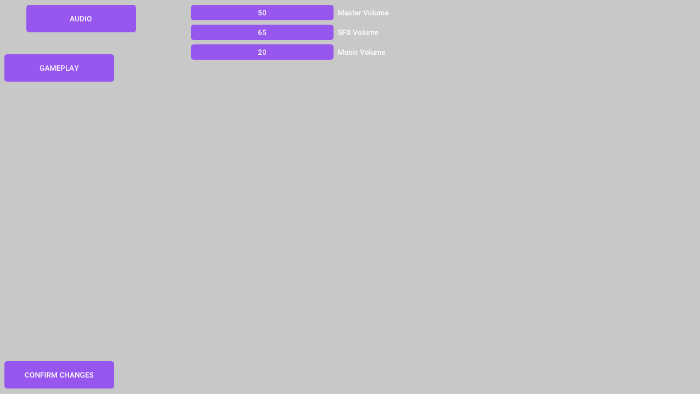

# Don't Fall

## Overview
Don't Fall is a game that challenges players to control the character using the powerful recoil of their shotgun.  
The main objective is to navigate through the game environment, avoiding randomly spawned obstacles.  
The twist lies in collecting ammo to maintain airborne momentum and prevent the inevitable descent, that results in losing the game.

## Table of Contents
- [Features](#features)
- [Getting Started](#getting-started)
- [Gameplay](#gameplay)
  - [Core Mechanics](#core-mechanics)
  - [Objectives](#objectives)
  - [Controls](#controls)
- [Development](#development)
  - [Architecture](#architecture)
  - [Built With](#built-with)
  - [Contributing](#contributing)
- [Screenshoots](#screenshoots)

## Features
- **Recoil-Powered Movement**: Control your character using the recoil of a shotgun.

- **Randomized Obstacles**: Navigate through the game environment filled with randomly spawned obstacles.

- **Ammo Collection System**: Collect ammo strategically to maintain airborne momentum and prevent falling.

- **Pause and Menu Functionality**: Easily pause the game and access the menu with a convenient and intuitive control.

- **Customizable Settings**: Customizable settings, including audio volumes and gameplay options.

- **Player Statistics System**: Track your progress with a simple player statistics system.

- **Persistent Stats Storage**: All statistics are automatically saved, creating a persistent record of your achievements.

## Getting Started
1. **Download the Project Files**: Obtain the game's source files from the repository.

2. **Run the Game**: Execute the `Dont_Fall.exe` file to play the game.

## Gameplay
### Core Mechanics:
- **Recoil Navigation**: Utilize the shotgun's recoil to move your character.
- **Random Obstacles**: Maneuver through obstacles that spawn unpredictably.
- **Ammo Collection**: Collect ammo strategically to maintain airborne momentum.

### Objectives:
- **Stay Airborne**: Prevent the inevitable descent by collecting ammo.
- **Avoid Obstacles**: Navigate skillfully to dodge obstacles and stay alive.
- **Beat Your Record**: Challenge yourself to achieve the longest airborne time.

### Controls
- **Left Mouse Button**: Shoot
- **F5**: Toggle Fullscreen
- **Esc**: Pause/Menu

## Development
### Architecture
Don't Fall follows a component-based game object system, organizing entities into modular components for flexibility and maintainability. The core architectural principles include:

- **Component-based Design**: Entities are composed of modular components, allowing for easy assembly and reusability.
    
- **GameObject System**: The game logic is structured around a robust game object system, facilitating efficient entity management.
    
- **Scalable and Extensible**: The architecture is designed to be scalable and extensible, making it straightforward to add new features and components.  

### Built With
- **Raylib Framework**

- **Premake Build System**

- **Visual Studio 2022 IDE**

### Contributing
Don't Fall is an open project, and I welcome any type of feedback! Here's how you can get involved:

- **Bug Fixes**: Spotted a bug? Feel free to let me know.
  
- **Enhancements**: Got an idea to make the game better? Sure, why not!

- **Optimizations**: Know a trick or two to make things faster? I wanna hear it.

- **Feedback**: Whether it's a compliment, a suggestion, or whatever, go for it.

## Screenshoots

  
   
  <em>Caption for Screenshot 1</em>

  
   
  <em>Caption for Screenshot 2</em>

  
   
  <em>Caption for Screenshot 3</em>

  
   
  <em>Caption for Screenshot 4</em>

  
   
  <em>Caption for Screenshot 5</em>

